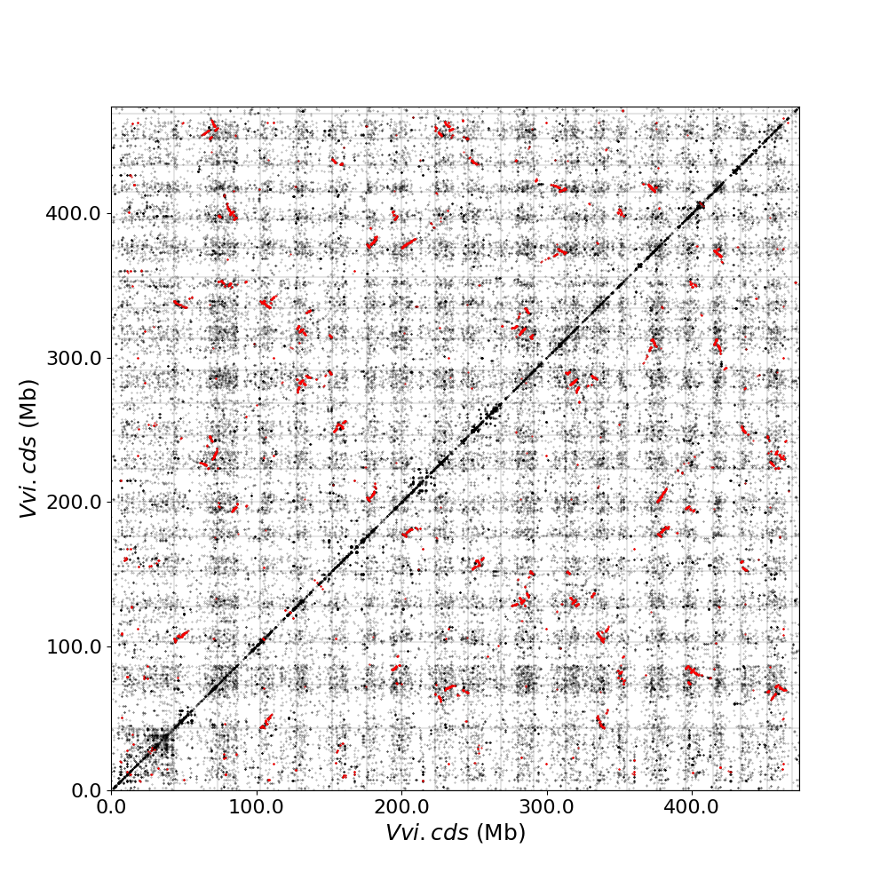
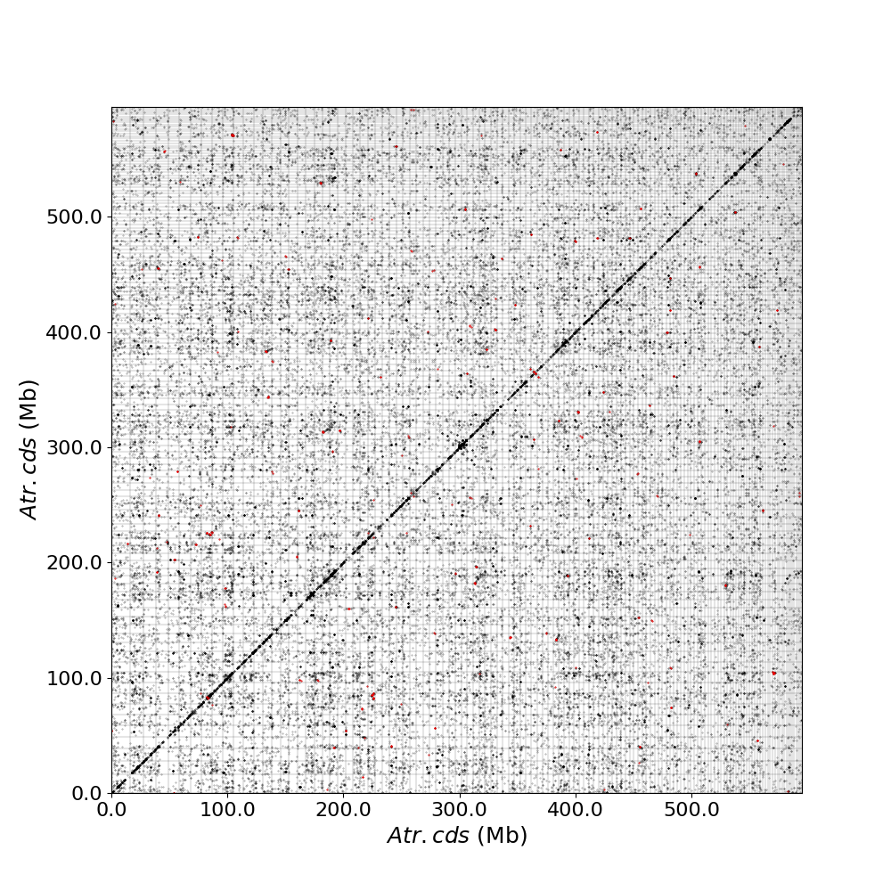
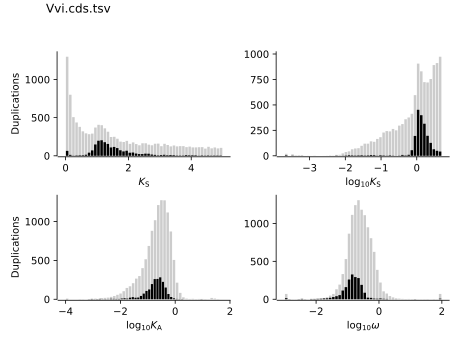
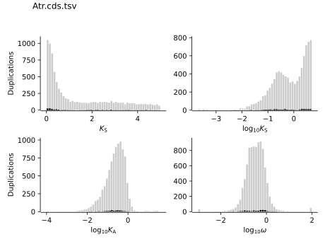

<div align="center">

# `wgd v2` : a suite tool of WGD inference and timing

[](https://travis-ci.com/arzwa/wgd)

**Hengchi Chen, Arthur Zwaenepoel, Yves Van de Peer**

[**Bioinformatics & Evolutionary Genomics Group**](https://www.vandepeerlab.org/)**, VIB-UGent Center for Plant Systems Biology**

[**Introduction**](#Introduction) | 
[**Installation**](#Installation) | 
[**Table of Parameters**](#Parameters) | 
[**Tutorial**](#Tutorial) | 
[**Citation**](#Citation)

</div>

`wgd v2` is a python package upgraded from the original `wgd` package aiming for the inference and timing of ancient whole-genome duplication (WGD) events. For the propose of illustrating the principle and usage of `wgd v2`, we compiled this documentation. Below we first give an introduction over the scope and mechanism of `wgd v2` and then the practical information of installation and usage. An examplar workflow is provided in the tutorial section on how to seek evidence for a putative WGD event and perform proper timing with a freshly obtained genome assembly in hand. For those who are interested, we recommend turning to our paper and book chapter for more detailed description and insightful discussions. If you use `wgd v2` in your research, please cite us. 

## Introduction

Polyploidizations, the evolutionary process that the entire genome of an organism is duplicated, also named as whole-genome duplications (WGDs), occur recurrently across the tree of life. There are two modes of polyploidizations, autopolyploidizations and allopolyploidizations. Autopolyploidizations are the duplication of the same genome, resulting in two identical subgenomes at the time it emerged. While the allopolyploidizations are normally achieved in two steps, first the hybridization between two different species, resulting in the arising of transient homoploidy,second the duplication of the homoploidy, resulting in the emergence of allopolyploidy. Due to the unstability and unbalanced tetrasomic inheritance, for instance the nuclear-cytoplasmic incompatibility, the polyploidy genome will then experience a process called diploidization, also named as fractionation, during which a large portion of gene duplicates will get lost and only a fraction can be retained. The traces of polyploidizations can be thus unearthed from these retained gene duplicates. Three approaches based on gene duplicates, namely, *K*<sub>S</sub> method, gene tree - species tree reconciliation method and synteny method, are commonly used in detecting evidence for WGDs. The gene tree - species tree reconciliation method is not within the scope of `wgd v2`, but we kindly refer readers who are interested to the phylogenomic program developed by Arthur Zwaenepoel named [WHALE](https://github.com/arzwa/Whale.jl) and the associated [paper](https://doi.org/10.1093/molbev/msz088) for more technical and theoretical details.

The *K*<sub>S</sub> method is established on a model of gene family evolution that each gene family is allowed to evolve via gene duplication and loss. Note that the gene family here is assumed to be the cluster of all genes descended from an ancestral gene in a single genome. Recovering the gene tree of such gene family informs the timing, scilicet the age, of gene duplication events. The age refered here, is not in real geological time, but in the unit of evolutionary distance, i.e., the number of substitutions per site. When the evolutionary rate remains approximately constant, the evolutionary distance is then supposed to be proportional to the real evolutionary time. The synonymous distance *K*<sub>S</sub>, the number of synonymous substitutions per synonymous site, is such candidate that synonymous substitutions would not incur the change of amino acid and are thus regarded as neutral, which according to the neutral theory should occur in constant rate. Given a model of gene family that allows the gene to duplicate and get lost in a fixed rate, one can derive that the probability density function of the *K*<sub>S</sub> age distribution of retained gene duplicates is a quasi-exponential function that most retained gene duplicates are recently borned with ~0 age while as the age going older the associated number of retained gene duplicates decay quasi-exponentially. Therefore, the occurance of large-scale gene duplication events, for instane WGDs, with varied retention rate, will leave an age peak from the burst of gene duplicates in a short time-frame upon the initial age distribution, and can be unveiled from mixture modeling analysis. However, WGDs identified from the paralogous *K*<sub>S</sub> age distributions can only inform the WGD timing in the time-scale of that specific species, which is not comparable in the phylogenetic context. Only with the orthologous *K*<sub>S</sub> age distributions, which convert the estimated body from paralogues to orthologues and inform the relative timing of speciation events, can we decipher the phylogenetic placement of WGDs after proper rate correction. `wgd v2` is such program that helps users construct paralogous and orthologous *K*<sub>S</sub> age distributions and realize both the identification and placement of WGDs.

## Installation

To install `wgd` in a virtual environment, the following command lines could be used.

```
git clone <wgd repo>
cd wgd
virtualenv -p=python3 ENV (or python3 -m venv ENV)
source ENV/bin/activate
pip install -r requirements.txt
pip install .
```

When met with permission problem in installation, please try the following command line.

```
pip install -e .
```

If multiply versions of `wgd` were installed in the system, please add the right path of interested version into the environment variables, for example

```
export PATH="$PATH:~/.local/bin/wgd"
```

## Parameters

There are 7 main programs in `wgd v2`: `dmd`,`focus`,`ksd`,`mix`,`peak`,`syn`,`viz`. Hereafter we will provide a detailed elucidation on each of the program and its associated parameters.

```
wgd dmd sequences (option)
--------------------------------------------------------------------------------
-o, --outdir, the output directory, default wgd_dmd
-t, --tmpdir, the temporary working directory, default None, if None was given, the tmpdir will be assigned random names in current directory and automately removed at the completion of program, else the tmpdir will be kept
-c, --cscore, the c-score to restrict the homologs of MRBHs, default None, if None was given, the c-score funcion won't be activated
-I, --inflation, the inflation factor for MCL program, default 2.0
-e, --eval, the e-value cut-off for similarity in diamond and/or hmmer, default 1e-10
--to_stop, flag option, whether to translate through STOP codons, if the flag was set, translation will be terminated at the first in frame stop codon, else a full translation continuing on past any stop codons will be initiated
--cds, flag option, whether to only translate the complete CDS that starts with a valid start codon and only contains a single in frame stop codon at the end and must be dividable by three, if the flag was set, only the complete CDS will be translated
-f, --focus, the species to be merged on local MRBHs, default None, if None was given, the local MRBHs won't be inferred
-ap, --anchorpoints, the anchor points data file, default None
-coc, --collinearcoalescence, flag option, whether to initiate the collinear coalescence analysis, if the flag was set, the analysis will be initiated
-sm, --segments, the segments data file used in collinear coalescence analysis if initiated, default None
-le, --listelements, the listsegments data file used in collinear coalescence analysis if initiated, default None
-gt, --genetable, the gene table datafile used in collinear coalescence analysis if initiated, default None
-kf, --keepfasta, flag option, whether to output the sequence information of MRBHs, if the flag was set, the sequences of MRBHs will be in output
-kd, --keepduplicates, flag option, whether to allow the same gene to occur in different MRBHs, if the flag was set, the same gene can be assigned to different MRBHs
-gm, --globalmrbh, flag option, whether to initiate global MRBHs construction, if the flag was set, the --focus option will be ignored and only global MRBHs will be built
-n, --nthreads, the number of threads to use, default 4
-oi, --orthoinfer, flag option, whether to initiate orthogroup infernece, if the flag was set, the orthogroup infernece program will be initiated
-oo, --onlyortho, flag option, whether to only conduct orthogroup infernece, if the flag was set, only the orthogroup infernece program will be conducted while the other analysis won't be initiated
-gn, --getnsog, flag option, whether to initiate the searching for nested single-copy gene families (NSOGs), if the flag was set, additional NSOGs analysis will be performed besides the basic orthogroup infernece
-tree, --tree_method, which gene tree inference program to invoke, default fasttree
-ts, --treeset, the parameters setting for gene tree inference, default None, this option can be provided multiple times
-mc, --msogcut, the ratio cutoff for mostly single-copy family and species representation in collinear coalescence inference, default 0.8.
-ga, --geneassign, flag option, whether to initiate the gene-to-family assignment analysis, if the flag was set, the analysis will be initiated
-am, --assign_method, which method to conduct the gene-to-family assignment analysis, default hmmer
-sa, --seq2assign, the queried sequences data file in gene-to-family assignment analysis, default None, this option can be provided multiple times
-fa, --fam2assign, the queried familiy data file in gene-to-family assignment analysis, default None
-cc, --concat, flag option, whether to initiate the concatenation pipeline for orthogroup infernece, if the flag was set, the analysis will be initiated
-te, --testsog, flag option, whether to initiate the unbiased test of single-copy gene families, if the flag was set, the analysis will be initiated
-bs, --bins, the number of bins divided in gene length normalization, default 100
-np, --normalizedpercent, the percentage of upper hits used for gene length normalization, default 5
-nn, --nonormalization, flag option, whether to call off the normalization, if the flag was set, no normalization will be conducted
-bsog, --buscosog, flag option, whether to initiate the busco-guided single-copy gene family analysis, if the flag was set, the analysis will be initiated
-bhmm, --buscohmm, the HMM profile datafile in the busco-guided single-copy gene family analysis, default None
-bctf, --buscocutoff, the HMM score cutoff datafile in the busco-guided single-copy gene family analysis, default None
```

```
wgd focus families sequences (option)
--------------------------------------------------------------------------------
-o, --outdir, the output directory, default wgd_focus
-t, --tmpdir, the temporary working directory, default None, if None was given, the tmpdir will be assigned random names in current directory and automately removed at the completion of program, else the tmpdir will be kept
-n, --nthreads, the number of threads to use, default 4
--to_stop, flag option, whether to translate through STOP codons, if the flag was set, translation will be terminated at the first in frame stop codon, else a full translation continuing on past any stop codons will be initiated
--cds, flag option, whether to only translate the complete CDS that starts with a valid start codon and only contains a single in frame stop codon at the end and must be dividable by three, if the flag was set, only the complete CDS will be translated
--strip_gaps, flag option, whether to drop all gaps in multiple sequence alignment, if the flag was set, all gaps will be dropped
-a, --aligner, which alignment program to use, default mafft
-tree, --tree_method, which gene tree inference program to invoke, default fasttree
-ts, --treeset, the parameters setting for gene tree inference, default None, this option can be provided multiple times
--concatenation, flag option, whether to initiate the concatenation-based species tree inference, if the flag was set, concatenation-based species tree will be infered
--coalescence, flag option, whether to initiate the coalescence-based species tree inference, if the flag was set, coalescence-based species tree will be infered
-sp, --speciestree, species tree darafile for dating, default None
-d, --dating, which molecular dating program to use, default none
-ds, --datingset, the parameters setting for dating program, default None, this option can be provided multiple times
-ns, --nsites, the nsites information for r8s dating, default None
-ot, --outgroup, the outgroup information for r8s dating, default None
-pt, --partition, flag option, whether to initiate partition dating analysis for codon, if the flag was set, an additional partition dating analysis will be initiated
-am, --aamodel, which protein model to be used in mcmctree, default poisson
-ks, flag option, whether to initiate Ks analysis
--annotation, which annotation program to use, default none
--pairwise, flag option, whether to initiate pairwise Ks estimation, if the flag was set, pairwise Ks values will be estimated
-ed, --eggnogdata, the eggnog annotation datafile, default None
--pfam, which option to use for pfam annotation, default none
--dmnb, the diamond database for annotation, default None
--hmm, the HMM profile for annotation, default None
--evalue, the e-value cut-off for annotation, default 1e-10
--exepath, the path to the interproscan executable, default None
-f, --fossil, the fossil calibration information in Beast, default ('clade1;clade2', 'taxa1,taxa2;taxa3,taxa4', '4;5', '0.5;0.6', '400;500')
 -rh, --rootheight, the root height calibration info in Beast, default (4,0.5,400)
-cs, --chainset, the parameters of MCMC chain in Beast, default (10000,100)
--beastlgjar, the path to beastLG.jar, default None
--beagle, flag option, whether to use beagle in Beast, if the flag was set, beagle will be used
--protdating, flag option, whether to only initiate the protein-concatenation based dating analysis, if the flag was set, the analysis will be initiated
```

```
wgd ksd families sequences (option)
--------------------------------------------------------------------------------
-o, --outdir, the output directory, default wgd_ksd
-t, --tmpdir, the temporary working directory, default None, if None was given, the tmpdir will be assigned random names in current directory and automately removed at the completion of program, else the tmpdir will be kept
-n, --nthreads, the number of threads to use, default 4
--to_stop, flag option, whether to translate through STOP codons, if the flag was set, translation will be terminated at the first in frame stop codon, else a full translation continuing on past any stop codons will be initiated
--cds, flag option, whether to only translate the complete CDS that starts with a valid start codon and only contains a single in frame stop codon at the end and must be dividable by three, if the flag was set, only the complete CDS will be translated
--pairwise, flag option, whether to initiate pairwise Ks estimation, if the flag was set, pairwise Ks values will be estimated
--strip_gaps, flag option, whether to drop all gaps in multiple sequence alignment, if the flag was set, all gaps will be dropped
-tree, --tree_method, which gene tree inference program to invoke, default fasttree
-sr, --spair, the species pair to be plotted, default None, this option can be provided multiple times
-sp, --speciestree, the species tree to perform rate correction, default None, if None was given, the rate correction analysis will be called off
-rw, --reweight, flag option, whether to recalculate the weight per species pair, if the flag was set, the weight will be recalculated
-or, --onlyrootout, flag option, whether to only conduct rate correction using the outgroup at root as outgroup, if the flag was set, only the outgroup at root will be used as outgroup
```

```
wgd mix ks_datafile (option)
--------------------------------------------------------------------------------
-f, --filters, the cutoff alignment length, default 300
-r, --ks_range, the Ks range to be considered, default (0.005, 3)
-b, --bins, the number of bins in Ks distribution, default 50
-o, --outdir, the output directory, default wgd_mix
--method, which mixture model to use, default gmm
-n, --components, the range of the number of components to fit, default (1, 4)
-g, --gamma, the gamma parameter for bgmm models, default 0.001
-ni, --n_init, the number of k-means initializations, default 200
-mi, --max_iter, the maximum number of iterations, default 1000
```

```
wgd peak ks_datafile (option)
--------------------------------------------------------------------------------
-ap, --anchorpoints, the anchor points datafile, default None
-sm, --segments, the segments datafile, default None
-le, --listelements, the listsegments datafile, default None 
-mp, --multipliconpairs, the multipliconpairs datafile, default None
-o, --outdir, the output directory, default wgd_peak
-af, --alignfilter, cutoff for alignment identity, length and coverage, default 0.0, 0, 0.0
-r, --ksrange, range of Ks to be analyzed, default (0, 5)
-bw, --bin_width, bandwidth of Ks distribution, default 0.1
-ic, --weights_outliers_included, flag option, whether to include Ks outliers, if the flag was set, Ks outliers will be included in the analysis
-m, --method, which mixture model to use, default gmm
--seed, random seed given to initialization, default 2352890
-ei, --em_iter, the number of EM iterations to perform, default 200
-ni, --n_init, the number of k-means initializations, default 200
-n, --components, the range of the number of components to fit, default (1, 4)
--boots, the number of bootstrap replicates of kde, default 200
--weighted, flag option, whether to use node-weighted method of de-redundancy, if the flag was set, the node-weighted method will be used
-p, --plot, the plotting method to be used, default identical
-bm, --bw_method, the bandwidth method to be used, default silverman
--n_medoids, the number of medoids to fit, default 2
-km, --kdemethod, the kde method to be used, default scipy
--n_clusters, the number of clusters to plot Elbow loss function, default 5
--kmedoids, flag option, whether to initiate K-Medoids clustering analysis, if the flag was set, the analysis will be initiated
-gd, --guide, the regime residing anchors, default: segment
-prct, --prominence_cutoff, the prominence cutoff of acceptable peaks, default 0.1
-kd, --kstodate, the range of Ks to be dated, default (0.5, 1.5)
-f, --family, the family to filter Ks upon, default None
--manualset, flag option, whether to output anchor pairs with manually set Ks range, if the flag was set, manually set Ks range will be used
-rh, --rel_height, the relative height at which the peak width is measured, default 0.4
--ci, the confidence level of log-normal distribution to date, default 95
--hdr, the highest densidy region (HDR) in a given distribution to date, default 95
--heuristic, flag option, whether to initiate heuristic method of defining CI for dating, if the flag was set, the heuristic method will be initiated
-kc, --kscutoff, the Ks saturation cutoff in dating, default 5
```

```
wgd syn families gffs (option)
--------------------------------------------------------------------------------
-ks, --ks_distribution, ks distribution datafile, default None
-o, --outdir, the output directory, default wgd_syn
-f, --feature, the feature for parsing gene IDs from GFF files, default gene
-a, --attribute, the attribute for parsing the gene IDs from the GFF files, default ID
-ml, --minlen, the minimum length of a scaffold to be included in dotplot, default -1, if -1 was set, the 10% of the longest scaffold will be set
-ms, --maxsize, the maximum family size to include, default 200
-r, --ks_range, the Ks range in colored dotplot, default (0, 5)
--iadhore_options, the parameter setting in iadhore, default 
-ac, --ancestor, the assumed ancestor species, default None, a option that is still in development
-mg, --minseglen, the minimum length of segments to include in ratio if <= 1, default 100000
-kr, --keepredun, flag option, whether to keep redundant multiplicons, if the flag was set, the redundant multiplicons will be kept
```

```
wgd viz (option)
--------------------------------------------------------------------------------
-d, --datafile, the Ks datafile, default None
-o, --outdir, the output directory, default wgd_viz
-sr, --spair, the species pair to be plotted, default None, this option can be provided multiple times
-gs, --gsmap, the gene name-species name map, default None
-sp, --speciestree, the species tree to perform rate correction, default None, if None was given, the rate correction analysis will be called off
-pk, --plotkde, flag option, whether to plot kde curve upon histogram, if the flag was set, kde curve will be added
-rw, --reweight, flag option, whether to recalculate the weight per species pair, if the flag was set, the weight will be recalculated
-or, --onlyrootout, flag option, whether to only conduct rate correction using the outgroup at root as outgroup, if the flag was set, only the outgroup at root will be used as outgroup
-iter, --em_iterations, the maximum EM iterations, default 200
-init, --em_initializations, the maximum EM initializations, default 200
-prct, --prominence_cutoff, the prominence cutoff of acceptable peaks, default 0.1
-sm, --segments, the segments data file, default None
-ml, --minlen, the minimum length of a scaffold to be included in dotplot, default -1, if -1 was set, the 10% of the longest scaffold will be set
-ms, --maxsize, the maximum family size to include, default 200
-ap, --anchorpoints, the anchor points datafile, default None
-mt, --multiplicon, the multiplicons datafile, default None
-gt, --genetable, the gene table datafile, default None
-rh, --rel_height, the relative height at which the peak width is measured, default 0.4
-mg, --minseglen, the minimum length of segments to include in ratio if <= 1, default 100000
-kr, --keepredun, flag option, whether to keep redundant multiplicons, if the flag was set, the redundant multiplicons will be kept
```

## Step 3 Construction of Ks Distribution

### Gene Family Delineation

An all-against-all protein sequence similarity search using `DIAMOND` and Markov Clustering using `MCL` are performed to delineate paralogous gene families using the following command. (Please make sure that both the program `DIAMOND` and `MCL` have been add into the environment variables)

```
wgd dmd data/Vvi.cds -I 3.0 -o data/Vvi_wgd_dmd
wgd dmd data/Atr.cds -I 3.0 -o data/Atr_wgd_dmd
```

Note that the option -I defines the inflation factor for MCL clustering, here we set an empirical 3.0. The option -e defines the e-value cut-off for similarity and here we use default e-10. We recommend the `DIAMOND` instead of the `BLAST` as the searching engine for both the time efficiency and accuracy.

After above command, we are supposed to get the paralogous gene family files [Vvi.cds.tsv](https://github.com/heche-psb/wgd/tree/dev/data/Vvi_wgd_dmd/Vvi.cds.tsv/) and [Atr.cds.tsv](https://github.com/heche-psb/wgd/tree/dev/data/Atr_wgd_dmd/Atr.cds.tsv/) for *V. vinifera* and *A. trichopoda*, respectively, each line of which represents a paralogous gene family. 

### Estimation of Ks Distance

Given the paralogous gene family information, we can start estimating the Ks distance for each pair of gene duplicates for each paralogous gene family using the following command. `PAML` is required for this step, please turn to Ziheng Yang's [lab page](http://abacus.gene.ucl.ac.uk/software/#phylogenetic-analysis-by-maximum-likelihood-paml) for detailed guidance of installation. Besides, `PAML 4.9j` works well in our test and is thereby recommended. The program `MAFFT` is required for the sequence alignment.

```
wgd ksd -n 8 --pairwise data/Vvi_wgd_dmd/Vvi.cds.tsv data/Vvi.cds -o data/Vvi_wgd_ksd
wgd ksd -n 8 --pairwise data/Atr_wgd_dmd/Atr.cds.tsv data/Atr.cds -o data/Atr_wgd_ksd
```

Note that here we set the option `--pairwise` to run `codeml` on all gene pairs separately. If `--pairwise` is not set, the aggressive algorithm built-in `codeml` would enforce all paralogs in the same family to have a single shared aligned nucleotide sequence with the removal of all gaps, probably resulting in a great loss of information. We recommend the set of `--pairwise` to fully exploit the information in the sequence data.


The Ks distribution of *V. vinifera* shows a considerable enrichment of gene duplicates around Ks~1, while the Ks distribution of *A. trichopoda* seems to follow the uniform/quasi-exponential mixture (see detailed discussion in the book chapter), indicating that *V. vinifera* might experience a relatively recent WGD event (or any other multiplication level for instance whole genome triplication) while *A. trichopoda* not. Such observation serves as the first piece of evidence for the inference of WGD events, which we will further seek to corroborate by the synteny analysis in step 4.

## Step 4 Synteny Analysis

### Intragenomic Synteny

The multiplication of the entire genome is supposed to instantaneously generate an additional copy of each chromosome, retaining both the gene order and gene content of the original copy. Despite chromosomal rearrangements and rampant gene loss following WGD, gene order and gene content are expected to be more or less retained on at least some chromosomes in reasonable time frames. Such chromosomal region is named *Syntenic Region*, which is assumed to be originated from the duplication of a common ancestral genomic region and considered as strong evidence for WGD once detected. A straightforward way to depict the synteny relationship within a genome is to draw a `whole-genome dotplot`, where both the x-axis and y-axis represent the same genome, and each square represents a single chromosome-to-chromosome comparison. Homologs are shown as dots while anchor pairs, defined as homologous pairs on syntenic regions, are marked in a distinct color. To delineate the synteny relationship, we use [I-ADHoRe 3.0](https://github.com/VIB-PSB/i-ADHoRe) to obtain such dotplots using the following command. 

```
wgd syn -f mRNA data/Vvi_wgd_dmd/Vvi.cds.tsv data/Vvi.gff3 -ks data/Vvi_wgd_ksd/Vvi.cds.tsv.ks.tsv -o data/Vvi_wgd_syn
wgd syn -f mRNA data/Atr_wgd_dmd/Atr.cds.tsv data/Atr.gff3 -ks data/Atr_wgd_ksd/Atr.cds.tsv.ks.tsv -o data/Atr_wgd_syn
```




When multiple anchors are located adjacently, a red diagonal line, reflecting a syntenic block, can be observed. We can find quite some syntenic blocks in the intragenomic dotplot of *V. vinifera* and a close examination reveals that for many chromosomal regions, we find two copies showing conserved gene order on other chromosomes, suggesting an ancestral genome triplication (hexaploidization). While for *A. trichopoda*, the anchors are negligible, implying no recent WGD.


Let's take a look at the synteny depth (or multiplication level) bar plot, in which we can find that *V. vinifera* has obviously more "level>2" synteny regions , among which the multiplication level 3 is dominant, suggesting the hexaploidization origin. While *A. trichopoda* has near-zero "level>2" synteny regions.

We can draw a duplication level plot to make this pattern clearer using i-adhore by command:

```
perl dupliStacks.pl data/Vvi_wgd_syn/iadhore.conf
``` 
Note that [dupliStacks.pl](https://github.com/VIB-PSB/i-ADHoRe/blob/master/post_processing/dupliStacks.pl) is an external perl script in `i-ADHoRe`, which we will merge into `wgd` soon. We don't keep the intermediate files in the [data](https://github.com/heche-psb/wgd/tree/dev/data) folder, only the final discussed results are kept.


The duplication level plot further shows that most syntenic regions consist of three homologous segments, which again is suggestive of *V. vitifera*’s ancestral hexaploidy. 

We can also find evidence for this putative WGD event from the correspondence of peak in Ks distributions for anchor pairs and whole-paranome.




### Intergenomic Synteny

Besides the intragenomic synteny evidence, the intergenomic synteny is another strong indicator for the inference of putative WGD events. This step we perform an intergenomic comparison to profile the synteny relationship between *V. vinifera* and *A. trichopoda*. The orthologous gene family needed here is obtained by `OrthoFinder` using command:

```
orthofinder -f data/prot -t 16 -og
```

The result file [Orthogroups.tsv](https://github.com/heche-psb/wgd/tree/dev/data/Orthogroups.tsv) is used for next step. We implement the following command.

```
wgd syn -f mRNA data/Orthogroups.tsv data/Atr.gff3 data/Vvi.gff3 -o data/Vvi_Atr_wgd_syn
```


 

We modfiy the interspecific dotplot manually to highlight the syntenic regions which is 3:1 ratio. The synteny depth bar plot shows that except for an obvious 1:1 ratio, mainly a ratio of 2:1 and 3:1 is uncovered. Combined with the results of the intragenomic comparisons, we can rather confidently conclude that *V. vinifera* experienced a paleo-hexaploidization event after its divergence of *A. trichopoda*.

## Citation
 
Please cite us at https://doi.org/10.1093/bioinformatics/bty915

```
Arthur Zwaenepoel, Yves Van de Peer, wgd—simple command line tools for the analysis of ancient whole-genome duplications, Bioinformatics, Volume 35, Issue 12, June 2019, Pages 2153–2155, https://doi.org/10.1093/bioinformatics/bty915

Hengchi Chen, Arthur Zwaenepoel (2023). Inference of Ancient Polyploidy from Genomic Data. In: Van de Peer, Y. (eds) Polyploidy. Methods in Molecular Biology, vol 2545. Humana, New York, NY. https://doi.org/10.1007/978-1-0716-2561-3_1
```

For citation of the tools used in wgd, please consult the documentation at
https://wgd.readthedocs.io/en/latest/index.html#citation.

